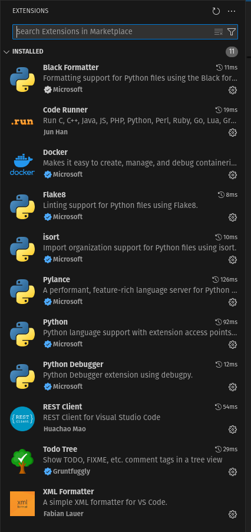

# Tópicos em DjangoRestFramework

Anotei aqui alguns tópicos importantes em DjangoRestFramework.

Mas é importante consultar a documentação original da linguagem em:

0. https://www.django-rest-framework.org/
0. https://www.djangoproject.com/
0. https://learndjango.com/
0. https://www.w3schools.com/django/
0. https://www.geeksforgeeks.org/django-tutorial/
0. https://www.tutorialspoint.com/django/index.htm

# Sumário dos tópicos

0. ([select_related](select_related/readme.md)) select_related
0. ([prefetch_related](prefetch_related/readme.md)) prefetch_related

Meu Script para criar pasta
```
mkdir input; cd input; touch readme.md; touch code_1.py; cd ..
```

# Ambiente de desenvolvimento


## Linux
Ou instalar o ambiente localmente. Para Linux segue meu roteiro.

Verificar se o python 3.12 esta ativo
```
  pyenv versions
```

Se nao estiver instalado, então instalar com 

```
pyenv install 3.12.0
```

Marcar como o compilador local
```
pyenv local 3.12.0
```
Instalar poetry com 
```
poetry init

Would you like... no
Would you like... no
```
Conferindo se a pasta .venv foi criada. Senão verifique estas configs
```
poetry config --list

poetry config virtualenvs.create = true
poetry config virtualenvs.in-project = true
```

Instalando pacotes
```
poetry add boto3
poetry add dj-database-url
poetry add django
poetry add django-cors-headers
poetry add django-debug-toolbar
poetry add django-filter
poetry add django-imagekit
poetry add django-storages[s3]
poetry add djangorestframework
poetry add djangorestframework-simplejwt
poetry add drf-spectacular
poetry add gunicorn
poetry add mailtrap
poetry add pillow
poetry add psycopg2-binary
poetry add python-decouple
poetry add requests
```
Se já houver um pyproject.toml use apenas o comando a seguir. Ou

Se assim que adicionar com poetry add ele não instalar. Apenas adicionar. Então tem que instalar após add.
```
poetry install
```

Ativar poetry a cada trabalho
```
poetry shell
```

## Linux - old
```
$ mkdir project_name
$ cd project_name
$ python -m venv venv
$ source ./venv/bin/activate
$ pip install django
$ django-admin --version
$ django-admin startproject project .
$ python manager.py migrate
$ python manager.py createsuperuser
$ python manager.py runserver <ip_local>:8000
$ cd project
$ python manager.py startapp app1
```

### VSCode
Instale as seguintes extensões:




# Criando projeto DjangoRF

## Criando projeto

Estando em uma pasta qualquer
```
django-admin startproject backend .
```
## Criando apps
```
cd backend
django-admin startapp users
django-admin startapp core
```

## Iniciar banco de dados

```
python manage.py makemigrations; python manage.py migrate
```

## Criar super user
```
python manage.py createsuperuser
```
Sugestão de emai e senha é:
username/email: admin@django.com
senha: drf@10

# Comandos de dev diario

## iniciar poetry
Na pasta do projeto digite
```
poetry shell
```
Entao vai aparecer
```
(nomeDoProjeto-py3.12) catalunha@pop-os:~/.../pastaDoProjeto$
```

## ativar servidor
(nomeDoProjeto-py3.12) catalunha@pop-os:~/.../pastaDoProjeto$
python manage.py runserver 192.168.10.117:8000
192.168.10.117:8000

## acessar admin ou recriar senha
(nomeDoProjeto-py3.12) catalunha@pop-os:~/.../pastaDoProjeto$
python manage.py changepassword admin@gmail.com

senha atual da conta admin@gmail.com é: django@123

## aplicar migrações
(nomeDoProjeto-py3.12) catalunha@pop-os:~/.../pastaDoProjeto$
python manage.py makemigrations; python manage.py migrate
